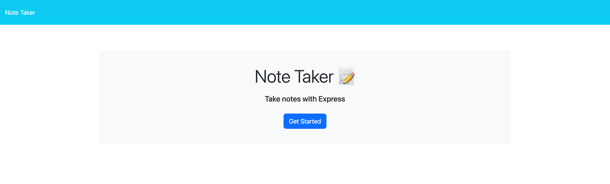
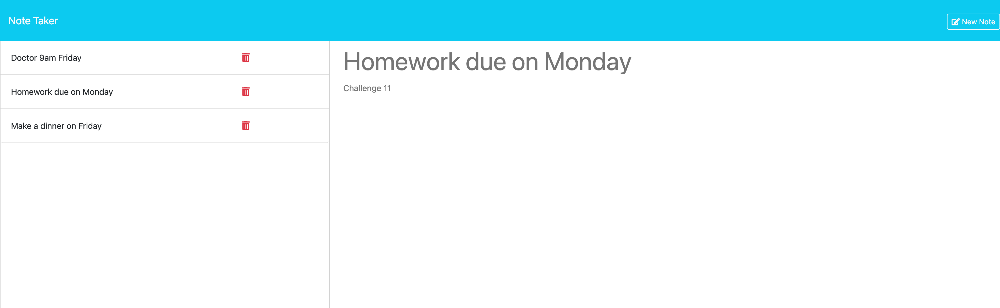

# Note Taker 
This application is a Note Taker.

## Description
The starter code has been received. It contains HTML, CSS and JavaScript.
The back end was created using Express.js.
The application can be used to write, save and delete notes.

## Usage
1. Open: https://note-taker-4px8.onrender.com
2. Press Get Started button.
3. Enter Title and Note text. Then press Save Note button. You'll see your note in the left-hand column.
4. If you want to delete a note press a trash-bin sign.

## Installation
1. npm i
2. npm start

## Technologies Used
- HTML
- CSS
- JavaScript
- Express. js (was added)

## Contribution guidelines
1. To make some changes create a feature branch. This is the branch where you will be adding a new code.
2. In the feature branch make commits of all the  changes in your code while working.
3. Push up the changes to feature branch in GitHub repo.
4. Open pull request.
5. Wait untill pull request is approved.

## Test instructions
N/A

## Mock-Up

The following images show the wed-site appearance and functionality:

